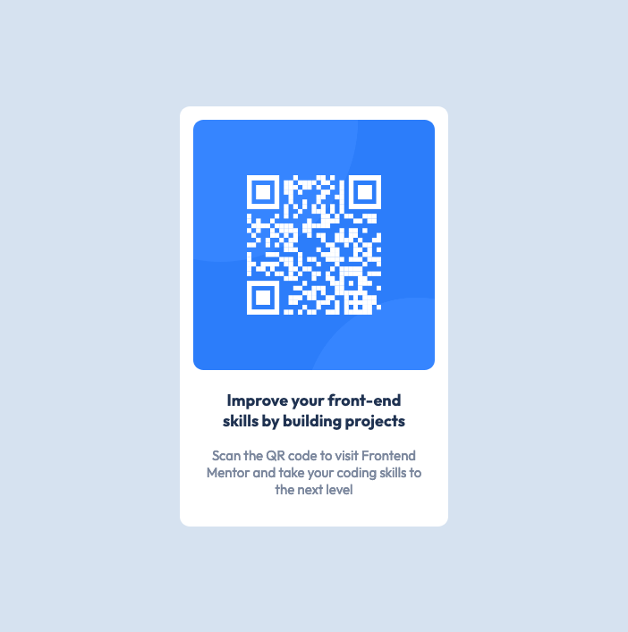

# Frontend Mentor - QR code component solution

This is a solution to the [QR code component challenge on Frontend Mentor](https://www.frontendmentor.io/challenges/qr-code-component-iux_sIO_H). Frontend Mentor challenges help you improve your coding skills by building realistic projects. 

## Table of contents

- [Overview](#overview)
  - [Screenshot](#screenshot)
- [My process](#my-process)
  - [Built with](#built-with)
  - [What I learned](#what-i-learned)
  - [Continued development](#continued-development)
  - [Useful resources](#useful-resources)
- [Author](#author)


## Overview

### Screenshot




## My process

### Built with

- Semantic HTML5 markup
- CSS Flexbox


### What I learned

How to center items both horizontally and vertically

```css
.container {
  display: flex;
  justify-content: center;
  align-items: center;
}    
```


### Continued development

1.Accurate use of relative length units
  (e.g. em, rem, vh, vw, etc.)
2.Responsive design
  - pay closer attention to the sizes of mobiles and tablets
3.BEM
  - get to know more about what is block, element, and modifier
    in a web page and structure them correctly.
  - also combining with css, think what naming convention should be used


### Useful resources

- [MDN Web Docs](https://www.example.com) - This website has the comprehensive documentation of HTML and CSS. I strongly recommend this website to anyone who are learning fundamental concepts of these technologies.


## Author

- Twitter - [@Akatchan1](https://www.twitter.com/Akatchan1)

